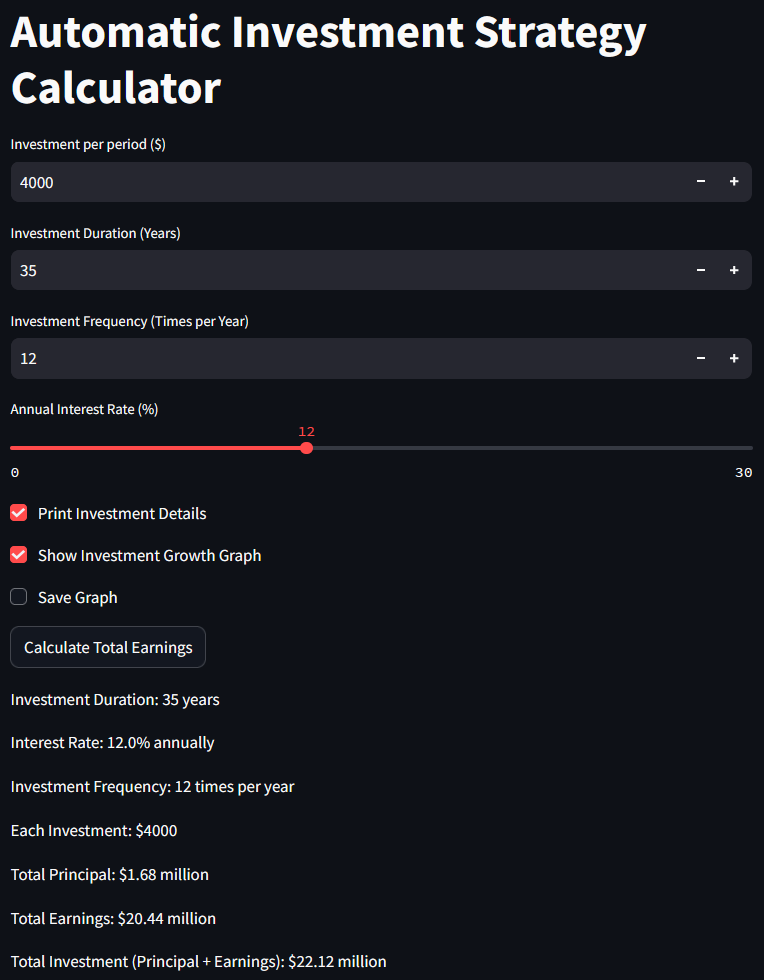
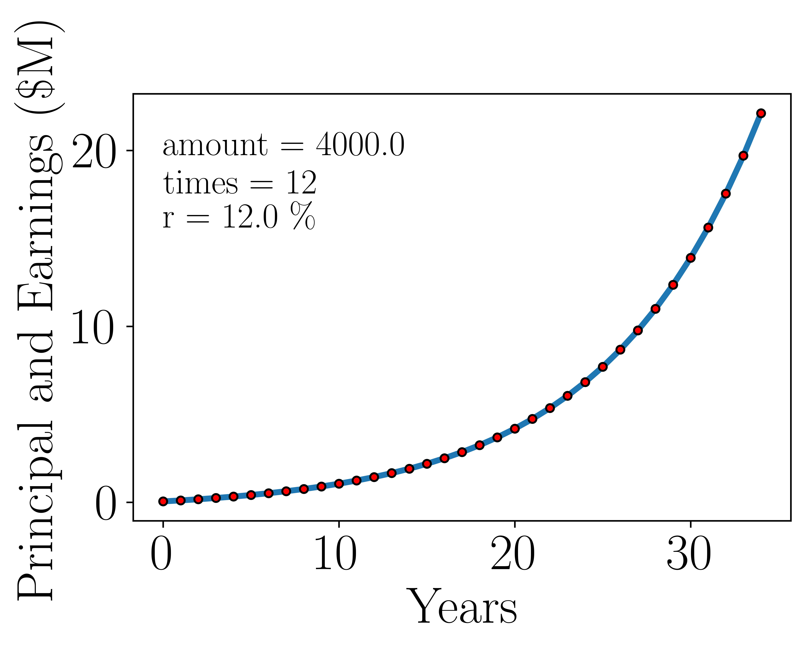

# DCA Return Calculator
The Investment Class allows you to calculate the earnings of an automatic investment strategy over a specified number of years, based on periodic contributions and an estimated average annual return. This model helps you simulate different investment scenarios and evaluate the long-term impact of regular investments on your overall portfolio.

By inputting the initial investment amount, frequency of contributions, expected rate of return, and duration, you can estimate the future value of your investments, including both principal and compounded earnings.

## Investment Class Module

### Overview

The Investment Class allows you to calculate the earnings of an automatic investment strategy over a specified number of years, based on periodic contributions and an estimated average annual return. This model helps you simulate different investment scenarios and evaluate the long-term impact of regular investments on your overall portfolio.

By inputting the initial investment amount, frequency of contributions, expected rate of return, and duration, you can estimate the future value of your investments, including both principal and compounded earnings.

### Features
- **Interactive Dashboard**: Visualize and modify investment parameters through an interactive dashboard to better understand your investment growth.
- **Automatic Investment Contributions**: Set a fixed amount to be invested at regular intervals (monthly, quarterly, etc.).
- **Compounded Annual Return**: Estimate earnings based on a fixed average annual interest rate, compounded over the frequency of investments.
- **Customizable Frequency and Duration**: Define how often you make contributions and how many years the investment will last.
- **Visualization**: Plot the progression of your investments over time, showing both principal and earnings.

### Interactive Dashboard Feature

An interactive dashboard allows you to customize investment parameters such as contribution amount, investment duration, interest rate, and frequency of contributions. You can visualize how these changes affect your overall portfolio. 

#### How to Run the Interactive Dashboard

1. **Run the Dashboard:**
   After cloning the repository, navigate to the directory where the `Investment` class is located, and run the following command:

   ```bash
   streamlit run auto_investment_calculator.py
   ```  
  
  #### Screenshot of the Interactive Dashboard
  <p align="center">
  
  </p>
  This will start a local web server, and you can interact with the dashboard in your browser. You’ll be able to modify investment parameters dynamically and visualize the results. The following result is generated by the dashboard:

  
  <p align="center">
  
  </p>

### Class Description

#### Investment Class

The `Investment` class calculates the total value of your investment, considering periodic contributions and compounding returns. The class provides options to display results and graph the growth of your investment over time.

##### Constructor Parameters
- `price` (float): The amount to be invested in each period (e.g., monthly, yearly).
- `years` (int): The number of years the investment will last.
- `times` (int): The frequency of contributions (e.g., 12 for monthly, 1 for yearly).
- `interest` (float): The average annual return rate (expressed as a decimal, e.g., 0.12 for 12%).
- `print_value` (bool): If `True`, the function will print detailed results.
- `graph_bool` (bool): If `True`, the function will plot a graph showing the growth of your investment.
- `save` (bool): If `True`, the generated graph will be saved as a PDF.

##### Methods
- `Auto_Investment_calculator`: Calculates the total value of your investment, including earnings, and optionally prints results and generates a graph.

### Example Usage

```python
from auto_investment_calculator import Investment

# Define your investment details
investment = Investment(price=4000, years=35, times=12, interest=0.12, print_value=True, graph_bool=True, save=False)

# Calculate and display the total earnings
total_earnings = investment.Auto_Investment_calculator()
```
